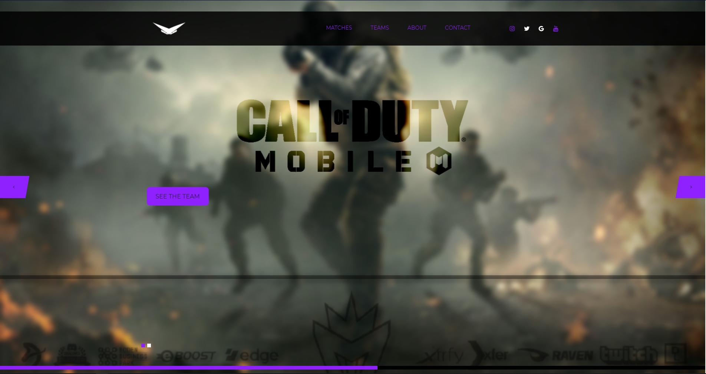
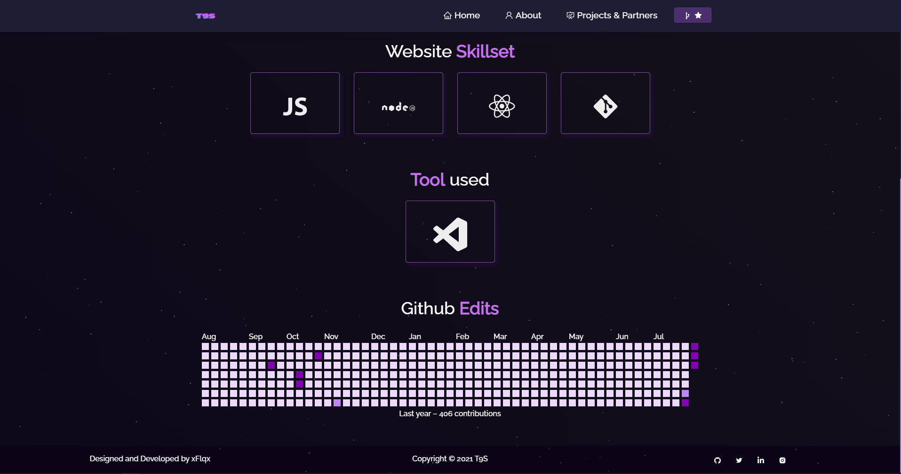

# Client Work

## Minator Network

  

 &nbsp;
 &nbsp;
 &nbsp;

## The Nine Society

  

 &nbsp;
 &nbsp;
 &nbsp;

## Skillset Used

	
* Laravel
* Forge Laravel
* HTML/CSS/JS
* MySql (InnoDB)
* Bootstrap
* Blade
* NPM Dependencies

# Tools Used
* React
* VSCode
* Atom
* Vercel
* Netlify
* Github
